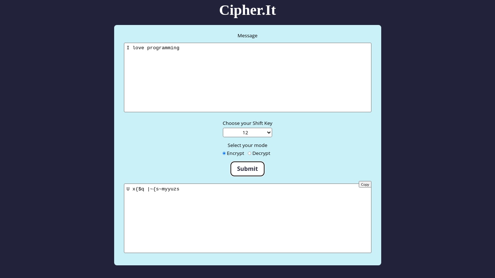
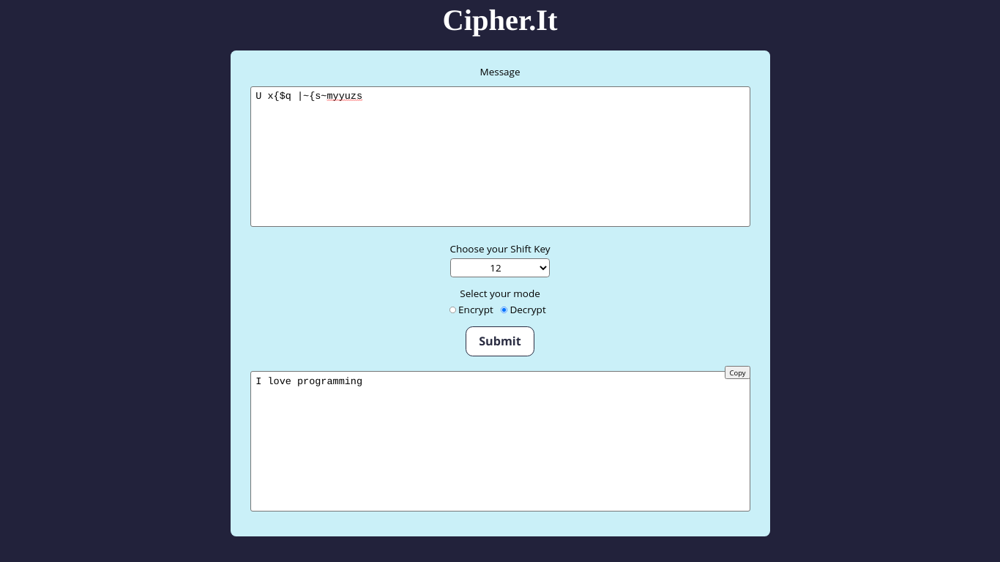

# cipher-it
Cipher.It is a message encryption & decryption website built on Ceasar Cipher's principle. 

## Screenshots

## What is Caesar's Cipher? 
The Caesar Cipher technique is one of the earliest and simplest method of encryption technique. It’s simply a type of substitution cipher, i.e., each letter of a given text is replaced by a letter some fixed number of positions down the alphabet. For example with a shift of 1, A would be replaced by B, B would become C, and so on. The method is apparently named after Julius Caesar, who apparently used it to communicate with his officials. 

## How it works? 
Cipher.It encrypts the message based on the *Shift Key* selected by the user. In order to decrypt the cipher, one needs to remember the shift key. 
